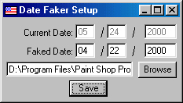



## Date Faker and Evaluation Period Bypass

### Description

Launch Date Faker and it will change the date (to a previous one if you want), launch an application, then change the date back to the current date. This can help delay evaluation periods for that stuborn piece of software that you haven't used for the last 2 months which says that the evaluation period is up even though has been pretty much unused. This is not a crack, it doesn't alter any files, and it isn't intended to be used in a malicious manner, but it can (and most likely will) help prolong your software evaluation period. Small, easy to understand file input/output code and date manipulation.

Please rate and leave comments.
 
### More Info
 
Make sure not to use this for anything bad... then that would be bad...

It will temporarily change the system date to fake out the program.

             |
---                |---
**Submitted On**   |2000-05-24 17:38:38
**By**             |[specialk](https://github.com/Planet-Source-Code/PSCIndex/blob/master/ByAuthor/specialk.md)
**Level**          |Beginner
**User Rating**    |4.2 (21 globes from 5 users)
**Compatibility**  |VB 5\.0, VB 6\.0
**Category**       |[Files/ File Controls/ Input/ Output](https://github.com/Planet-Source-Code/PSCIndex/blob/master/ByCategory/files-file-controls-input-output__1-3.md)
**World**          |[Visual Basic](https://github.com/Planet-Source-Code/PSCIndex/blob/master/ByWorld/visual-basic.md)
**Archive File**   |[CODE\_UPLOAD60955252000\.zip](https://github.com/Planet-Source-Code/specialk-date-faker-and-evaluation-period-bypass__1-8333/archive/master.zip)

